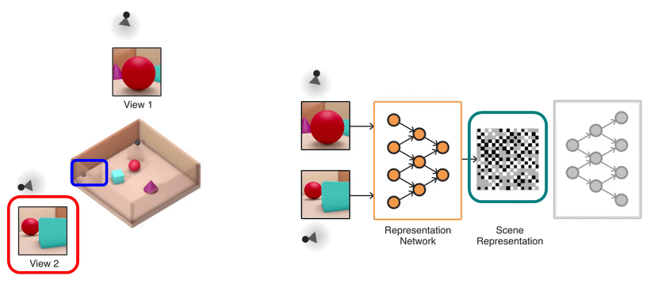
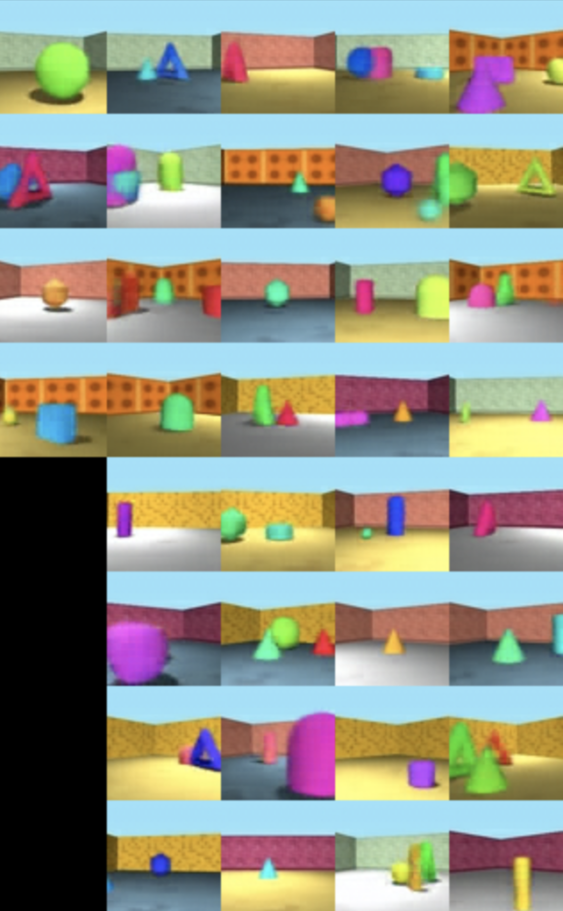
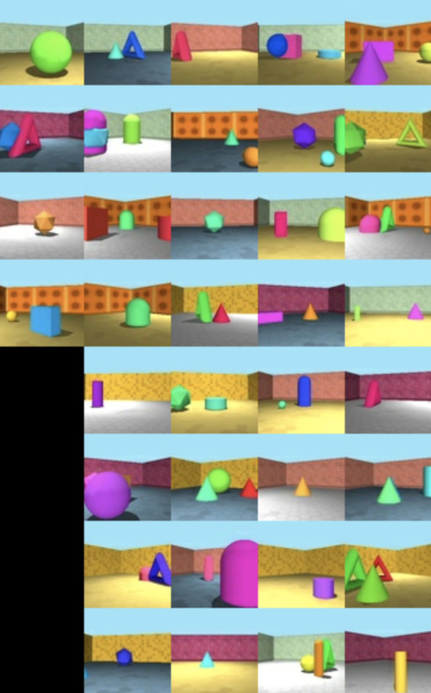

# torch-gqn

[](https://github.com/DveloperY0115/torch-gqn/actions/workflows/ubuntu.yml)
[](https://www.codefactor.io/repository/github/dvelopery0115/torch-gqn/overview/main)
[](https://www.codacy.com/gh/DveloperY0115/torch-gqn/dashboard?utm_source=github.com&amp;utm_medium=referral&amp;utm_content=DveloperY0115/torch-gqn&amp;utm_campaign=Badge_Grade)

Pytorch implementation of GQN, *Generative Query Network* proposed in the paper *Neural scene representation and rendering, Eslami et al., Science*.



# Generation Output
The following figures are side-by-side comparisons of prediction and ground-truth. **The left one is the prediction from GQN after 400k iterations, and the right image is the ground-truth.**  



# Quick Start

## 0. Env Setup
After cloning the repository, move into the directory you've just cloned and run following code to configure virtual environment.
```
# setup conda virtual environment 'torch-gqn'
conda env create --file environment.yaml
```

## 1. Get Datasets
The official dataset is distributed [here](https://github.com/deepmind/gqn-datasets).  
Visit the page, follow the instructions to download the dataset of your preference. **It's recommended to download the dataset under `data` directory** because there's a python script for converting serialized tfrecord files into pickle files which are used in this project.

**Note: The code is tested on 'rooms_ring_camera' dataset only.** For other examples like shepard_metzler_\*_parts, you may wish to take a look at [Implementation from iShohei220](https://github.com/iShohei220/torch-gqn) or [Implementation from Jesper Wohlert](https://github.com/wohlert/generative-query-network-pytorch)

## 2. Convert Dataset
In the project root directory, execute the following code fragment:
```
cd data
python convert_to_torch.py rooms_ring_camera
```
For me, **converting 1 million data took almost three days.** Also, I set the code to terminate after converting 1 million training data and 200k test data due to limited disk capacity, you should modify the code depending on your environment.

## 3. Run Training
Again in the project root directory, execute the following code fragment:  
**Warning! Training takes a lot of time, so you may want to use `tmux` or other terminal multiplexers** of your preference so that the training keeps running even when you close the terminal. 
```
python train_gqn.py
```
You can adjust parameters associated with training (+ hyperparameters) via argument parser on the top of the `train_gqn.py` file.

# Pre-trained model
I provide you 
[(2.3 GB) Pre-trained model + Checkpoint](https://drive.google.com/file/d/1iZj4c5Bv6mZ5iaOIdJ7pQZYMrk0Qkw5b/view?usp=sharing) at 500k-th iteration.
The file on the drive contains
- Pre-trained parameters of GQN model
- Additional information to continue training (optimizer parameters, scheduler parameters, etc..)

To use this, you'll need to get & convert **rooms_ring_camera** dataset following the instructions in 1 and 2. And then simply pass the path of *.tar* file to the *argparser* in *train_gqn.py*. Then you'll be able to check the training statistics and generation outputs via Tensorboard.
